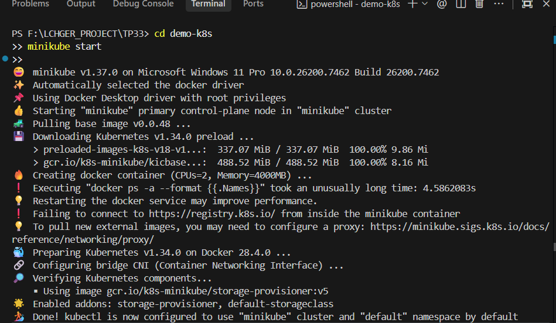
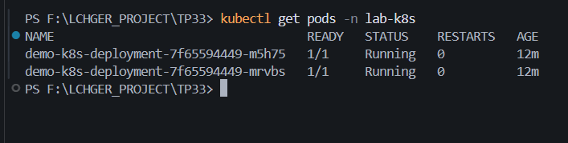
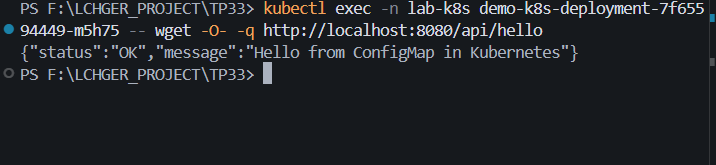

# Spring Boot sur Kubernetes

Déploiement d'une application Spring Boot sur Kubernetes avec Minikube.

## Setup

**1. Build & Docker:**

```bash
./mvnw clean package -DskipTests
docker build -t demo-k8s:1.0.0 .
```

**2. Minikube:**

```bash
minikube start --driver=docker
minikube image load demo-k8s:1.0.0
```

**3. Deploy:**

```bash
kubectl create namespace lab-k8s
kubectl apply -f k8s/configmap.yaml
kubectl apply -f k8s/deployment.yaml
kubectl apply -f k8s/service.yaml
```

## Test

**Port-forward:**

```bash
kubectl port-forward -n lab-k8s svc/demo-k8s-service 9090:8080
# Accéder: http://localhost:9090/api/hello
```

**Ou via Minikube:**

```bash
minikube service demo-k8s-service -n lab-k8s --url
```

**Réponse attendue:**

```json
{ "message": "Hello from ConfigMap in Kubernetes", "status": "OK" }
```

## Screenshots





## Commandes Utiles

```bash
# Vérifier
kubectl get pods -n lab-k8s
kubectl logs -f <pod-name> -n lab-k8s

# Scaler
kubectl scale deployment/demo-k8s-deployment -n lab-k8s --replicas=3

# Dashboard
minikube dashboard

# Nettoyage
kubectl delete -f k8s/
kubectl delete namespace lab-k8s
minikube stop
```

## Configuration

- **Replicas:** 2
- **Port:** 8080
- **NodePort:** 30080
- **Message:** Configuré via ConfigMap (`k8s/configmap.yaml`)
